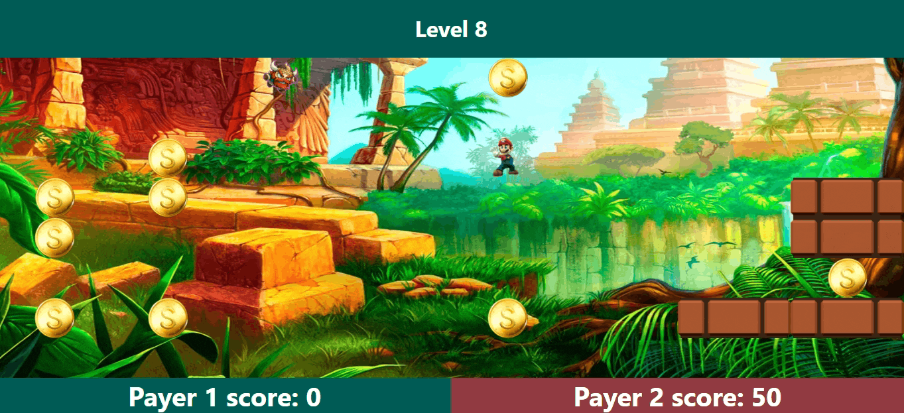

[![Contributors][contributors-shield]][contributors-url]


<!-- PROJECT LOGO -->
<br />
<p align="center">
  <a href="https://github.com/tomeraitz/gold-rush-server">
    
  </a>

  <h3 align="center">Gold Rush Server</h3>

  <p align="center">
  A Game Gold Rush - this repo is the server-side with nestjs.
    <br />
    <br />
    <br />
    <a href="https://gold-rush.netlify.app/">View Demo</a>
    ·
    <a href="https://github.com/tomeraitz/gold-rush-server/issues">Report Bug</a>
  </p>
</p>


<!-- TABLE OF CONTENTS -->
<details open="open">
  <summary><h2 style="display: inline-block">Contents</h2></summary>
  <ol>
    <li>
      <a href="#about-the-project">About The Project</a>
      <ul>
        <li><a href="#built-with">Built With</a></li>
      </ul>
    </li>
    <li>
      <a href="#getting-started">Getting Started</a>
      <ul>
        <li><a href="#prerequisites">Prerequisites</a></li>
        <li><a href="#installation">Installation</a></li>
      </ul>
    </li>
    <li><a href="#File">File Hierarchy</a></li>
    <li><a href="#acknowledgements">Acknowledgements</a></li>
  </ol>
</details>


<!-- ABOUT THE PROJECT -->
## About The Project


This Repository is server-side, here we can find the logic that controls the game with WebSocket.
### Built With

* [Nest.js](https://nestjs.com/)
* [nestjs/websockets](https://www.npmjs.com/package/@nestjs/websockets)
* [PathFinding.js](https://www.npmjs.com/package/pathfinding)

## Getting Started
To get a local copy up and running follow these simple steps.

### Prerequisites
If you want to control the project from nest.js cli I suggest you install nest.js first: 
* npm
  ```sh
  npm i -g @nestjs/cli
  ```

### Installation

1. Clone the repo
   ```sh
   git clone https://github.com/tomeraitz/gold-rush-server.git
   ```
2. Install NPM packages
   ```sh
   npm install
   ```
3. Run It on localhost with client repository(8000)
    ```sh
   npm run start:dev 
   ```
**Note!** This project won't do a lot without the [client side](https://github.com/tomeraitz/gold-rush-client).

4. Run It on localhost with test environment(8000) 
    ```sh
   npm run start:debug 
   ```
**Note!** This is only a simple UI to check if the functions work.

<!-- USAGE EXAMPLES -->
<h3 id="File">File Hierarchy</h3>

**src**
  - main.ts - Activate the server
  - app.modules.ts - Import all the main modules.
  - app.controller.ts - The default get request.
-  **single-player**
    - single-player.gateway.ts - The script that Activates the WebSocket.
    - single-player.modules.ts - Import the game module.
-  **gold-rush-game**
    - gold-rush-game-logic.service.ts - Inside it's all the computer calculation movement.
    - gold-rush-game.controller.ts - This script receives and gives back data from WebSocket.
    - gold-rush-game.module.ts - Import the game module and websocket module.
    - gold-rush-game.service.ts - This script is handled with all the user inputs and creates the game data.
## Acknowledgements

* The project live at [Heroku](https://devcenter.heroku.com/)
* The Read me file was created with the template [Best-README-Template](https://github.com/othneildrew/Best-README-Template)

[contributors-shield]: https://img.shields.io/github/contributors/tomeraitz/gold-rush-server?color=green&style=for-the-badge
[contributors-url]: https://github.com/tomeraitz/gold-rush-server/graphs/contributors
